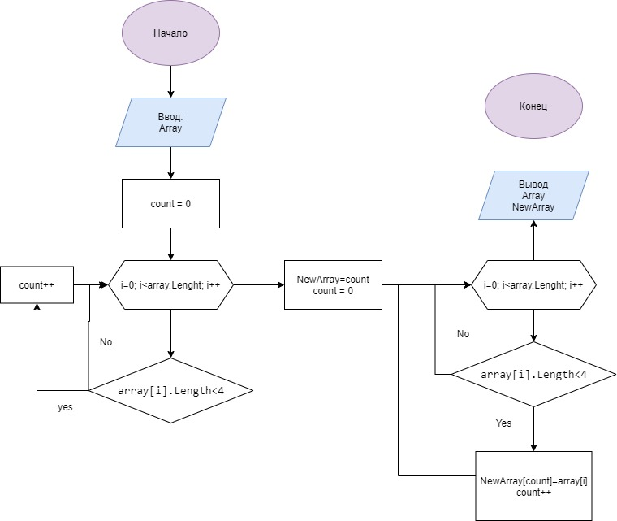

# Итоговая проверочная работа.
## В процессе работы было выполнено:
* Был создан репозиторий на GitHub.
* Нарисована блок-схема алгоритма содержательной части (метода CreatingASecondArray).
* Написан файл readme с описанием решения.
* Написана программа решающая поставленную задачу.

## Описание решения:
На старте программы создано два массива, первый заполнен элементами, второй меньшего размера пустой. Тип данных выбран string.
Далее второй массив наполняется элементами из первого (с помощью цикла).
Завершается программа выводом результата в терминал (так как показано в примерах к задаче).
В работе использована система контроля версий, этапы выполнения отражены в коммитах.
## Схема решения
